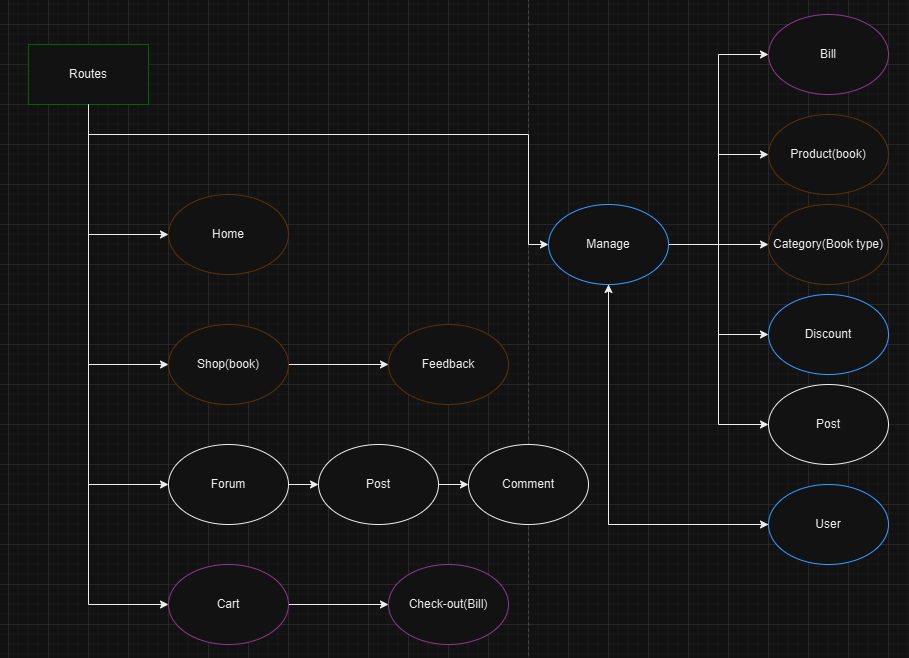

# Đồ án môn lập trình web của nhóm X lớp D21CQCN02-N
## Đề tài: 
- Shop bán sách + diễn dàn sinh viên

## Thông tin kĩ thuật: 
 - JDK1.8(cho server tomcat)
 - Java phiên bản >= 9(cho rsp/Community Server Connectors)
 - Server tomcat
 - MSSQL server với database có sẵn "BOOKSHOP".

## Chức năng
- Xem sơ đồ dưới
 
 - Giải thích: là các đường dẫn đến các chức năng cùng vai trò (theo viền)
	 - Khang: viền trắng
	 - Long: viền nâu
	 - Phương: viền lam
	 - Thương: viền tím

## Thành viên

<table>
    <tr>
        <th>Tên</th>
        <th>Link Github</th>
        <th>Vai trò</th>
    </tr>
    <tr>
        <td>Nguyễn Phúc Minh Khang</td>
        <td><a href="https://github.com/NguyenPhucMinhKhang">NguyenPhucMinhKhang</a></td>
        <td>
	    - Toàn bộ phần diễn đàn, bài viết và bình luận, bao gồm cả CRUD  <br>
	    - Phân bổ công việc  
    </td>
    </tr>
    <tr>
        <td>Nguyễn Phi Long</td>
        <td><a href="https://github.com/NguyenPhiLongIT">NguyenPhiLongIT</a></td>
        <td>
    - Làm phần trang chủ, shop(book) bao gồm đánh giá và phản hồi <br> 
    - CRUD của sách và thể loại sách   
	    </td>
    </tr>
    <tr>
        <td>Phạm Bùi Nam Phương</td>
        <td><a href="https://github.com/Phuongp2003">Phuongp2003</a></td>
        <td>
     - Khởi tạo và quản lý dự án <br> 
    - Làm phần quản lý tài khoản gồm đăng nhập, xử lý vai trò, quản lý thành viên/tài khoản (bao gồm CRUD)
    - Quản lý giảm giá <br>
    - Hỗ trợ sửa lỗi ~~ngủ trong bug đúng nghĩa~~
        </td>
    </tr>
    <tr>
        <td>Tô Phan Kiều Thương</td>
        <td><a href="https://github.com/ThuongPhan662003">ThuongPhan662003</a></td>
        <td>
        - Làm phần giỏ hàng, hoá đơn (bao gồm cả CRUD) <br>
        - Hỗ trợ làm phần trang chủ
        </td>
    </tr>
</table>

## Cài đặt
**Note:** vào lần đầu mở project, có thể có một cảnh báo hiện lên về yêu cầu bản JDK cao hơn, hãy bỏ qua nó:


1. Cài đặt Extension Pack for Java, Community Server Connectors trong vscode market place.
2. Cài đặt [jdk1.8](https://www.oracle.com/java/technologies/javase/javase8-archive-downloads.html) (yêu cầu).
3. Ở mục Explorer (Ctrl+Shift+E) bên trái màn hình, tìm thẻ "Server", thêm tomcat server có sẵn (use server on disk) hoặc tải bản có sãn từ mục chọn, đề xuất phiên bản 8.5.
4. Ở lần đầu khởi tạo project, bạn nên chạy task build đã định nghĩa sẵn (ctrl + shift + b) hoặc bất cứ công cụ nào khác (maven, ...). Sau đó, ở các lần chạy tiếp theo, trừ khi có lượng lớn thay đổi một lúc, VSCode sẽ tự build lại cho bạn.
5. Chuột phải vào thư mục webapp (src/main/webapp) và chọn "Run on server" để deploy vào server.
   - Chọn server: server đã cài đặt
   - Thêm param: nếu cần thay đổi slug truy cập dự án
   - Project name: để trống

6. Mở trình duyệt và truy cập http://localhost:8080/webapp (sẽ là http://localhost:8080/<slug> nếu đã nhập param)
7. Hot reload(đã cài sẵn, nếu không hoạt động có thể cài lại):
   1. Ở Explorer, tìm thẻ "JAVA PROJECTS" -> chọn dấu 3 chấm -> chọn "Configure Classpath " -> chỉnh path thành "src/main/webapp/WEB-INF/classes" -> Save -> Apply.
   2. Ở cài đặt, tìm "Java: Auto Build" -> check
   3. Ở cài đặt, tìm "java.debug.settings.hotCodeReplace" -> đổi thành "auto".
   4. Ở cài đặt, tìm "java.configuration.updateBuildConfiguration" -> đổi thành "automatic"
8. Cài đặt database: xem file src/main/webapp/WEB-INF/configs/spring-config-hibernate.xml

## Cài đặt môi trường cho tomcat (lỗi hay gặp)

### 1. Tomcat

- Cài đặt vm.install.path
  - Tomcat từ đĩa: khi cài đặt, sẽ có một form như dưới hiện lên, chỉnh "vm.install.path" thành đường dẫn đến jdk 1.8 của bạn 
    
  - Tomcat tải từ server: chuột phải vào server -> Edit Server...
    Nó sẽ mở một file json, tìm "vm.install.path" và sửa đến jdk 1.8 của bạn

## Ghi chú 

### 1. Đổi cổng đầu ra (port)

- Ở thẻ Server, chuột phải vào server và chọn "Server Actions..."
- Chọn "Edit Configuration File"
- Chọn conf/server.xml
- Tìm "Connector port=" và đổi thành port bạn muốn
- Khởi động (lại) server.

### 2. Đổi đường dẫn/tên webapp 

- Cần đổi đường dẫn của thư mục classes
- Sửa trong file .vscode/.settings.
- Cây file: 

```
|___src
|      |_main
|      |_java
|      |  |_<controller_package>
|      |
|      |_webapp
|           |_WEB-INF
|               |_classes
|               |_lib
|               |_web.xml
|               |_index.jsp
|               |_...

```

### 3. Bug Community Server Connectors

- Nếu gặp lỗi với Community Server Connectors,có thể là do phiên bản jdk quá thấp. Hãy đổi thành phiên bản Java 9 hoặc cao hơn. Kiểm tra biến JAVA_HOME ở system environment variables nếu đã cài sẵn.

### 4. Lỗi Tomcat

- Log:

```
java.lang.ExceptionInInitializerError: Exception java.lang.ExceptionInInitializerError [in thread "localhost-startStop-1"]
	org.springframework.cglib.core.KeyFactory$Generator.generateClass(KeyFactory.java:166)
	org.springframework.cglib.core.DefaultGeneratorStrategy.generate(DefaultGeneratorStrategy.java:25)
	org.springframework.cglib.core.AbstractClassGenerator.create(AbstractClassGenerator.java:216)
	org.springframework.cglib.core.KeyFactory$Generator.create(KeyFactory.java:144)
	org.springframework.cglib.core.KeyFactory.create(KeyFactory.java:116)
	org.springframework.cglib.core.KeyFactory.create(KeyFactory.java:108)
	org.springframework.cglib.core.KeyFactory.create(KeyFactory.java:104)
	org.springframework.cglib.proxy.Enhancer.<clinit>(Enhancer.java:69)
	org.springframework.aop.framework.CglibAopProxy.createEnhancer(CglibAopProxy.java:234)
	org.springframework.aop.framework.CglibAopProxy.getProxy(CglibAopProxy.java:177)
	org.springframework.aop.framework.ProxyFactory.getProxy(ProxyFactory.java:111)
	org.springframework.aop.framework.autoproxy.AbstractAutoProxyCreator.createProxy(AbstractAutoProxyCreator.java:490)
	org.springframework.aop.framework.autoproxy.AbstractAutoProxyCreator.wrapIfNecessary(AbstractAutoProxyCreator.java:375)
	org.springframework.aop.framework.autoproxy.AbstractAutoProxyCreator.postProcessAfterInitialization(AbstractAutoProxyCreator.java:335)
```
- Cỏ thể do phiên bản jdk cho tomcat quá cao, xem phần cài đặt tomcat phía trên

### 5. Vần đề khi Run/Debug

- Server cần ở trạng thái "Started(or Debugging), Synchronized".
- Ở debugmode, bạn có thể hot reload dữ liệu mà không cần restart server (với css nếu không reload hãy ctrl+5/xoá cache ở trình duyệt)

### 6. Vấn đề với Java
- Có bug ở bean, có vẻ do xung đột phiên bản


- Xoá cache, reload project và nhắm mắt gacha chứ lỗi này... thua ╰(*°▽°*)╯.
