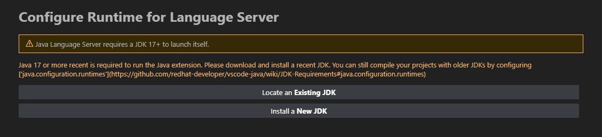
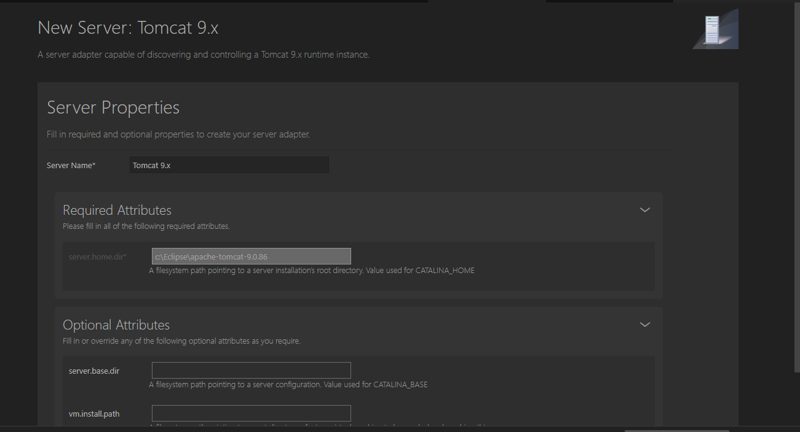

# Java Spring MVC Project with Tomcat

- This is a simple project to create a web project with java, tomcat.
- Required: jdk1.8(for tomcat), java version >= 9(for rsp/Community Server Connectors), tomcat, ms sql server with database name "BOOKSHOP".

# HOW TO USE
Tote: At the second time open project, it will warn you about "Run time need JDK 17+" like this, just skip it: 


1. Download Extension Pack for Java, Community Server Connectors in vscode market place.
2. Download [jdk1.8](https://www.oracle.com/java/technologies/javase/javase8-archive-downloads.html) (required).
3. In Explorer (Ctrl+Shift+E), look at tag "Server", add your tomcat server (use server on disk) or download a new server, recommend tomcat 8.5.
4. In the first time open project, you should build the project by run task build (ctrl + shift + b) or your java build tool. After build the first time, just go to java file and save to build a classes path.
5. Right click on the project (src/main/webapp) and choose "Run on server" to deploy the project on the server.
   - Choose server -> your server
   - Add params -> yes -> your project name (it will be your slug to view the project on the browser)
   - Project name -> empty

6. Open your browser and go to http://localhost:8080/<your_project_name>
7. Setup hot reload(it setup by default, if it's not working, you can do it manually): 
   1. At explorer, find tag "JAVA PROJECTS" -> click on "..." -> choose "Configure Classpath " -> edit output path to "src/main/webapp/WEB-INF/classes" -> Save -> Apply.
   2. On settings, find "Java: Auto Build" -> check it.
   3. On settings, find "java.debug.settings.hotCodeReplace" -> change it to "auto".
   4. On settings, find "java.configuration.updateBuildConfiguration" -> change it to "automatic"
8. Setup database: check src/main/webapp/WEB-INF/configs/spring-config-hibernate.xml

# Requirements configuration

## 1. Tomcat

- Setup vm.install.path
  - With tomcat from disk: when install, i will show a window like this, just edit in field "vm.install.path" to your jdk path.
    
  - With tomcat download from server: right click on your server -> Edit Server...
    It will open a file json, find "vm.install.path" and change it to your jdk path.

# NOTE

## 1. Change output port

- On tag Server, right click on your server and choose "Server Actions..."
- Choose "Edit Configuration File"
- Choose conf/server.xml
- Find "Connector port=" and change the port to your desired port.
- Restart/start your server.

## 2. Simple way to deploy with your project name

- When adding a project to the server, you keep param empty, your slug will be http://localhost:8080/webapp
- If you want to change the slug, you can change the webapp folder name to your desired name.

## 3. Change webapp folder name / path

- You need to change the path of classes too
- Edit in .vscode/.settings.
- This project files tree:

```
|___src
|      |_main
|      |_java
|      |  |_<controller_package>
|      |
|      |_webapp
|           |_WEB-INF
|               |_classes
|               |_lib
|               |_web.xml
|               |_index.jsp
|               |_...

```

## 5. Bug with Community Server Connectors

- If you have a bug with Community Server Connectors, it may cause by your java version. You can change your java version to 9 or higher to fix this bug. Check JAVA_HOME in your system environment variables if it's installed.

## 6. Bug with Tomcat

- Server log maybe look like this:

```
java.lang.ExceptionInInitializerError: Exception java.lang.ExceptionInInitializerError [in thread "localhost-startStop-1"]
	org.springframework.cglib.core.KeyFactory$Generator.generateClass(KeyFactory.java:166)
	org.springframework.cglib.core.DefaultGeneratorStrategy.generate(DefaultGeneratorStrategy.java:25)
	org.springframework.cglib.core.AbstractClassGenerator.create(AbstractClassGenerator.java:216)
	org.springframework.cglib.core.KeyFactory$Generator.create(KeyFactory.java:144)
	org.springframework.cglib.core.KeyFactory.create(KeyFactory.java:116)
	org.springframework.cglib.core.KeyFactory.create(KeyFactory.java:108)
	org.springframework.cglib.core.KeyFactory.create(KeyFactory.java:104)
	org.springframework.cglib.proxy.Enhancer.<clinit>(Enhancer.java:69)
	org.springframework.aop.framework.CglibAopProxy.createEnhancer(CglibAopProxy.java:234)
	org.springframework.aop.framework.CglibAopProxy.getProxy(CglibAopProxy.java:177)
	org.springframework.aop.framework.ProxyFactory.getProxy(ProxyFactory.java:111)
	org.springframework.aop.framework.autoproxy.AbstractAutoProxyCreator.createProxy(AbstractAutoProxyCreator.java:490)
	org.springframework.aop.framework.autoproxy.AbstractAutoProxyCreator.wrapIfNecessary(AbstractAutoProxyCreator.java:375)
	org.springframework.aop.framework.autoproxy.AbstractAutoProxyCreator.postProcessAfterInitialization(AbstractAutoProxyCreator.java:335)
```

- This bug may cause by your jdk version setup in your server. You can change your jdk version to 1.8 to fix this bug. Check [this](#2-tomcat) to know how to change your jdk version.

## 7. Run/Debug issue

- Server status must be "Started(or Debugging), Synchronized" to run/debug the project.
- In debugmode, you can hot reload the project by changing the code and save it, then click the hotload on debug bar.

## 8. Java issues
- I got some issues with java bean:


- Just try to clear cache of your IDE and java project, then rebuild the project with a pray ╰(*°▽°*)╯.
